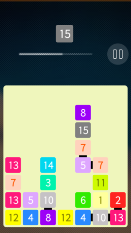

Twenty (for Jolla)
==================

This is an open source implementation of [Twenty][link1], a fast-paced game with numbers and gravity.

Platform: Sailfish OS.

How to play
-----------

- You could drag blocks to any free place.
- There is a gravitation.
- Two colliding blocks with the same number transform into a block with the incremented number.
- Your goal is to get to 20.

[link1]: http://twenty.frenchguys.net/
